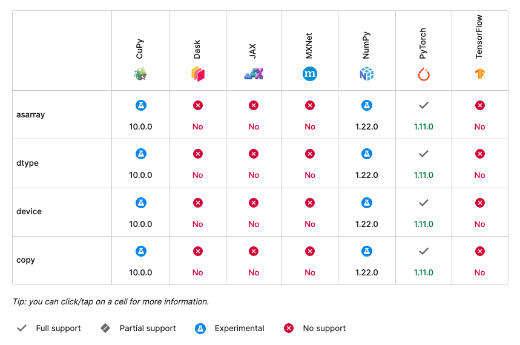
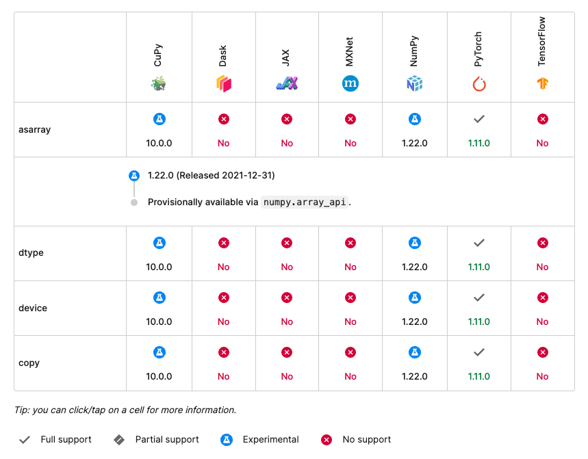
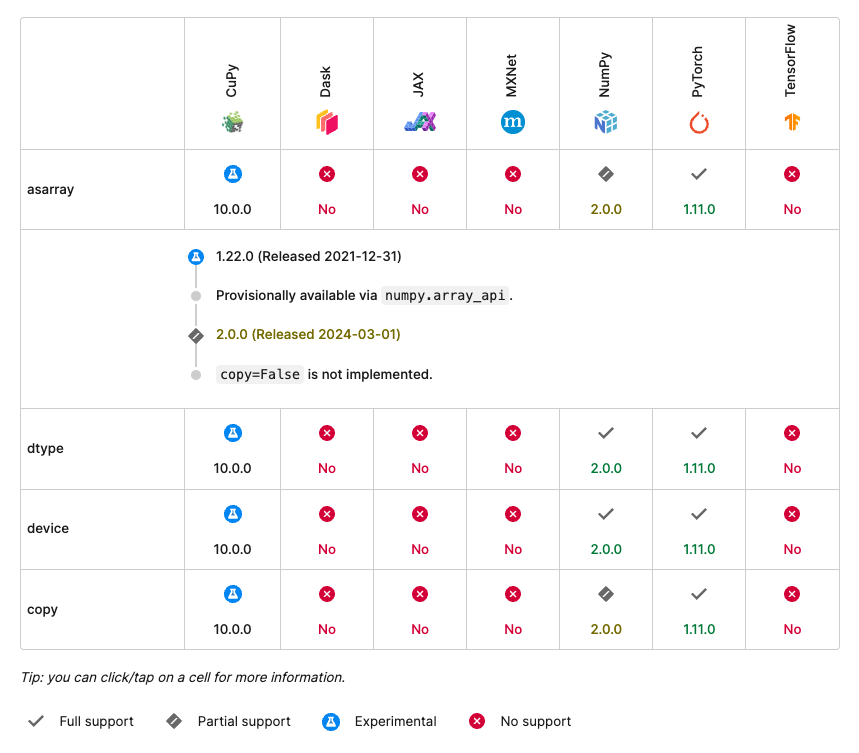
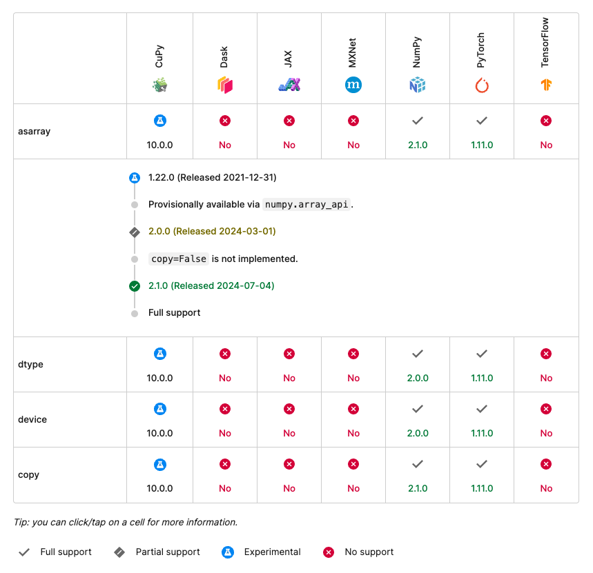

# Verification and Compliance

To facilitate adoption of this specification, adopters may rely on a set of complementary tools to verify and track Array API compliance.

For adopters wanting to implement an array library conforming to this specification, the Array API [test suite](https://github.com/data-apis/array-api-tests) will

1. assist in measuring specification conformance and
2. serve as a reference during test-driven development.

For downstream adopters wanting to assess compatibility across multiple array libraries, the compatibility tables embedded in the rendered API specification

1. provide a high-level snapshot of array library compliance for each specification version,
2. indicate the level of API portability across documented array libraries, and
3. detail minimum version requirements.

## Test suite

### Measuring conformance

Adopters of this specification can measure specification conformance by using the Array API test suite, which can be found at <https://github.com/data-apis/array-api-tests>.

The specification is the single source of truth. While the aim of the test suite is to fully cover the behavior as described in this specification, specification adopters should be aware that some aspects of the specification cannot covered by the test suite, typically because these aspects are impossible to effectively test. If the test suite appears to diverge in any way from what this specification states, the divergence should be considered a bug in the test suite.

### Running the tests

To run the test suite, first clone the [test suite repository](https://github.com/data-apis/array-api-tests), and install the test suite dependencies

```bash
pip install pytest hypothesis
```

or

```bash
conda install pytest hypothesis
```

and any array libraries that you want to test. Before running the test suite, specify the array library to be tested in one of two ways. Either set the `ARRAY_API_TESTS_MODULE` environment variable, such as

```text
ARRAY_API_TESTS_MODULE=numpy pytest
```

or, alternatively, edit the `array_api_tests/_array_module.py` file and change the
line

```py
array_module = None
```

to

```py
import numpy as array_module
```

(replacing `numpy` with the array module namespace to be tested).

In both cases, tests must be run with the `pytest` command.

The test suite has only two dependencies (`pytest` and `hypothesis`) and has no array library dependencies. The test suite is designed to be standalone in order to allow vendoring. All tests run against a specified array library and that library only.

See the [README](https://github.com/data-apis/array-api-tests/blob/master/README.md) in the test suite repository for more information about how to run the test suite and interpret test suite results.

## Compatibility tables

A compatibility table is a concise representation describing the level of support for a specific API across one or more array libraries.



For a single API, the anatomy of a compatibility table is as follows:

- The header row contains the list of array libraries for which compatibility data is tracked.
- The first row describes the level of support across the entire API.
- If an API supports keyword arguments and/or specialized behavior (e.g., support for complex number data types), each row following the first row describes the level of support for the respective keyword argument or specialized behavior.
- The first column in a row specifies the API, keyword argument, or behavior for which support is tracked.
- Each data cell following the first column describes the level of support for the respective API, keyword argument, or behavior for a specific array library.

A data cell describes the following levels of support in order of precedence:

- **No support**: an array library does not support a particular API, keyword argument, or behavior. For example, in the example compatibility table above, TensorFlow and JAX do not support the `asarray` API.
- **Experimental support**: an array library supports a particular API, keyword argument, or behavior (either fully or partially), but the library does so experimentally via an environment variable or in an experimental namespace or some other mechanism indicating that support is unstable and subject to possible change. For example, in the example compatibility table above, NumPy and CuPy both experimentally support the `asarray` API in a separate experimental `array_api` namespace.
- **Partial support**: an array library only partially supports a particular API, keyword argument, or behavior.
- **Full support**: an array library fully supports a particular API, keyword argument, or behavior. For example, in the example compatibility table above, PyTorch fully supports the `asarray` API beginning in PyTorch version 1.11.0.

In addition to support level, a data cell includes the first version in which an array library provides the displayed level of support. Based on the example compatibility table above, NumPy began offering experimental support for the `asarray` API beginning in NumPy version `1.22.0`, and CuPy began offering experimental support in `10.0.0`.

Associated with each data cell is a timeline describing the history of support for a particular API, keyword argument, or behavior for a respective library. The following compatibility table shows an expanded timeline based on the example compatibility table above.



Upon changes to a library's support level, a data cell should update to display the updated support status and the corresponding release for which the changes are attributed. For example, suppose that NumPy support is no longer experimental starting in version `2.0.0`; however, `copy` keyword argument support is still only partially implemented. In which case, the compatibility table should update as follows:



In the above compatibility table, NumPy has full support for `dtype` and `device` keyword arguments; however, because `copy` keyword argument support is only partially implemented, the entire `asarray` API is also only partially implemented.

If NumPy were to add full support for the `copy` keyword argument in version `2.1.0`, the compatibility table should update as follows:



Once a library achieves full support for a particular API, keyword argument, or behavior, no further status updates should be necessary.