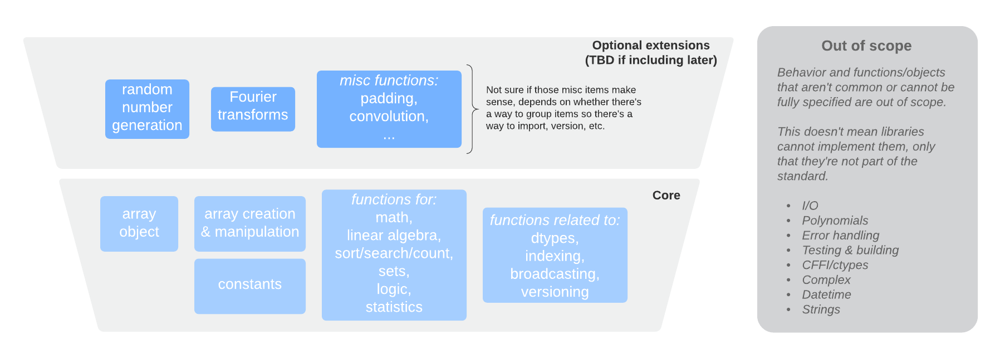

# Purpose and scope

## Introduction

Python users have a wealth of choice for libraries and frameworks for
numerical computing, data science, machine learning, and deep learning. New
frameworks pushing forward the state of the art in these fields are appearing
every year. One unintended consequence of all this activity and creativity
has been fragmentation in multidimensional array (a.k.a. tensor) libraries -
which are the fundamental data structure for these fields. Choices include
NumPy, Tensorflow, PyTorch, Dask, JAX, CuPy, MXNet, Xarray, and others.

The APIs of each of these libraries are largely similar, but with enough
differences that it's quite difficult to write code that works with multiple
(or all) of these libraries. This array API standard aims to address that
issue, by specifying an API for the most common ways arrays are constructed
and used.

Why not simply pick an existing API and bless that as the standard? In short,
because there are often good reasons for the current inconsistencies between
libraries. The most obvious candidate for that existing API is NumPy. However
NumPy was not designed with non-CPU devices, graph-based libraries, or JIT
compilers in mind. Other libraries often deviate from NumPy for good
(necessary) reasons. Choices made in this API standard are often the same
ones NumPy makes, or close to it, but are different where necessary to make
sure all existing array libraries can adopt this API.


### This API standard

This document aims to standardize functionality that exists in most/all array
libraries and either is commonly used or is needed for
consistency/completeness. Usage is determined via analysis of downstream
libraries, see {ref}`usage-data`. An example of consistency is: there are
functional equivalents for all Python operators (including the rarely used
ones).

Beyond usage and consistency, there's a set of use cases that inform the API
design to ensure it's fit for a wide range of users and situations - see
{ref}`use-cases`.

A question that may arise when reading this document is: _"what about
functionality that's not present in this document?_ This:

- means that there is no guarantee the functionality is present in libraries
  adhering to the standard
- does _not_ mean that that functionality is unimportant
- may indicate that that functionality, if present in a particular array
  library, is unlikely to be present in all other libraries

```{note}

This document is ready for wider community review, but still contains a
number of TODOs, and is expected to change and evolve before a first
official release. See {ref}`future-API-evolution` for proposed
versioning.
```

### History

The first library for numerical and scientific computing in Python was
Numeric, developed in the mid-1990s. In the early 2000s a second, similar
library, Numarray, was created. In 2005 NumPy was written, superceding both
Numeric and Numarray and resolving the fragmentation at that time. For
roughly a decade, NumPy was the only widely used array library. Over the past
~5 years, mainly due to the emergence of new hardware and the rise of deep
learning, many other libraries have appeared, leading to more severe
fragmentation. Concepts and APIs in newer libraries were often inspired by
(or copied from) those in older ones - and then changed or improved upon to
fit new needs and use cases. Individual library authors discussed ideas,
however there was never (before this array API standard) an serious attempt
to coordinate between all libraries to avoid fragmentation and arrive at a
common API standard.

The idea for this array API standard grew gradually out of many conversations
between maintainers during 2019-2020. It quickly became clear that any
attempt to write a new "reference library" to fix the current fragmentation
was infeasible - unlike in 2005, there are now too many different use cases
and too many stakeholders, and the speed of innovation is too high. In May
2020 an initial group of maintainers was assembled in the [Consortium for
Python Data API Standards](https://data-apis.org/) to start drafting a
specification for an array API that could be adopted by each of the existing
array and tensor libraries. That resulted in this document, describing that
API.


(Scope)=

## Scope (includes out-of-scope / non-goals)

This section outlines what is in scope and out of scope for this API standard.

### In scope

The scope of the array API standard includes:

- Functionality which needs to be included in an array library for it to adhere
  to this standard.
- Names of functions, methods, classes and other objects.
- Function signatures, including type annotations.
- Semantics of functions and methods. I.e. expected outputs including precision
  for and dtypes of numerical results.
- Semantics in the presence of `nan`'s, `inf`'s, empty arrays (i.e. arrays
  including one or more dimensions of size `0`).
- Casting rules, broadcasting, indexing
- Data interchange. I.e. protocols to convert one type of array into another
  type, potentially sharing memory.
- Device support.

Furthermore, meta-topics included in this standard include:

- Use cases for the API standard and assumptions made in it
- API standard adoption
- API standard versioning
- Future API standard evolution
- Array library and API standard versioning
- Verification of API standard conformance

The concrete set of functionality that is in scope for this version of the
standard is shown in this diagram (_TODO: update after deciding on how optional
extensions are dealt with_):




**Goals** for the API standard include:

- Make it possible for array-consuming libraries to start using multiple types
  of arrays as inputs.
- Enable more sharing and reuse of code built on top of the core functionality
  in the API standard.
- For authors of new array libraries, provide a concrete API that can be
  adopted as is, rather than each author having to decide what to borrow from
  where and where to deviate.
- Make the learning curve for users less steep when they switch from one array
  library to another one.


### Out of scope

1. Implementations of the standard are out of scope.

   _Rationale: the standard will consist of a document and an accompanying test
   suite with which the conformance of an implementation can be verified. Actual
   implementations will live in array libraries; no reference implementation is
   planned._

2. Execution semantics are out of scope. This includes single-threaded vs.
   parallel execution, task scheduling and synchronization, eager vs. delayed
   evaluation, performance characteristics of a particular implementation of the
   standard, and other such topics.

   _Rationale: execution is the domain of implementations. Attempting to specify
   execution behavior in a standard is likely to require much more fine-grained
   coordination between developers of implementations, and hence is likely to
   become an obstable to adoption._

3. Non-Python API standardization (e.g., Cython or NumPy C APIs)

   _Rationale: this is an important topic for some array-consuming libraries,
   but there is no widely shared C/Cython API and hence it doesn't make sense at
   this point in time to standardize anything. See
   the [C API section](design_topics/C_API.md) for more details._

4. Standardization of these dtypes is out of scope: bfloat16, complex, extended
   precision floating point, datetime, string, object and void dtypes.

   _Rationale: these dtypes aren't uniformly supported, and their inclusion at
   this point in time could put a significant implementation burden on
   libraries. It is expected that some of these dtypes - in particular
   `bfloat16`, `complex64`, and `complex128` - will be included in a future
   version of the standard._

5. The following topics are out of scope: I/O, polynomials, error handling,
   testing routines, building and packaging related functionality, methods of
   binding compiled code (e.g., `cffi`, `ctypes`), subclassing of an array
   class, masked arrays, and missing data.

   _Rationale: these topics are not core functionality for an array library,
   and/or are too tied to implementation details._

6. NumPy (generalized) universal functions, i.e. ufuncs and gufuncs.

   _Rationale: these are NumPy-specific concepts, and are mostly just a
   particular way of building regular functions with a few extra
   methods/properties._

7. Behaviour for unexpected/invalid input to functions and methods.

  _Rationale: there are a huge amount of ways in which users can provide
  invalid or unspecified input to functionality in the standard. Exception
  types or other resulting behaviour cannot be completely covered and would
  be hard to make consistent between libraries._


**Non-goals** for the API standard include:

- Making array libraries identical so they can be merged.

  _Each library will keep having its own particular strength, whether it's
  offering functionality beyond what's in the standard, performance advantages
  for a given use case, specific hardware or software environment support, or
  more._

- Implement a backend or runtime switching system to be able to switch from one
  array library to another with a single setting or line of code.

  _This may be feasible, however it's assumed that when an array-consuming
  library switches from one array type to another, some testing and possibly
  code adjustment for performance or other reasons may be needed._

- Making it possible to mix multiple array libraries in function calls.

  _Most array libraries do not know about other libraries, and the functions
  they implement may try to convert "foreign" input, or raise an exception.
  This behaviour is hard to specify; ensuring only a single array type is
  used is best left to the end user._


### TBD whether or not in scope, or for a later version

- Random number generation, Fourier transforms, and miscellaneous functionality
  like a padding function.

  _This will be decided later, depending on whether "optional extensions" will
  be added to the standard._


### Implications of in/out of scope

If something is out of scope and therefore will not be part of (the current
version of) the API standard, that means that there are no guarantees that that
functionality works the same way, or even exists at all, across the set of
array libraries that conform to the standard. It does _not_ imply that this
functionality is less important or should not be used.


## Stakeholders

Arrays are fundamental to scientific computing, data science, and machine
learning and deep learning. Hence there are many stakeholders for an array API
standard. The _direct_ stakeholders of this standard are **authors/maintainers of
Python array libraries**. There are many more types of _indirect_ stakeholders
though, including:

- maintainers of libraries and other programs which depend on array libraries
  (called "array-consuming libraries" in the rest of this document)
- authors of non-Python array libraries
- developers of compilers and runtimes with array-specific functionality
- end users

Libraries that are being actively considered - in terms of current behaviour and
API surface - during the creation of the first version of this standard
include:

- [NumPy](https://numpy.org)
- [TensorFlow](https://www.tensorflow.org/)
- [PyTorch](https://pytorch.org/)
- [MXNet](https://numpy.mxnet.io/)
- [JAX](https://github.com/google/jax)
- [Dask](https://dask.org/)
- [CuPy](https://cupy.chainer.org/)

Other Python array libraries that are currently under active development and
could adopt this API standard include:

- [xarray](https://xarray.pydata.org/)
- [PyData/Sparse](https://sparse.pydata.org)
- [Weld](https://github.com/weld-project/weld)
- [Bohrium](https://bohrium.readthedocs.io/)
- [Arkouda](https://github.com/mhmerrill/arkouda)
- [Legate](https://research.nvidia.com/publication/2019-11_Legate-NumPy%3A-Accelerated)

There are a huge amount of array-consuming libraries; some of the most
prominent ones that are being taken into account - in terms of current array
API usage or impact of design decisions on them - include (this list is likely
to grow it over time):

- [Pandas](https://pandas.pydata.org/)
- [SciPy](https://github.com/scipy/scipy)
- [scikit-learn](https://scikit-learn.org/)
- [Matplotlib](https://matplotlib.org/)
- [scikit-image](https://scikit-image.org/)
- [NetworkX](https://networkx.github.io/)

Array libraries in other languages, some of which may grow a Python API in the
future or have taken inspiration from NumPy or other array libraries, include:

- [Xtensor](https://xtensor.readthedocs.io) (C++, cross-language)
- [XND](https://xnd.io/) (C, cross-language)
- [stdlib](https://stdlib.io/) (JavaScript)
- [rust-ndarray](https://github.com/rust-ndarray/ndarray) (Rust)
- [rray](https://github.com/r-lib/rray) (R)
- [ND4J](https://github.com/deeplearning4j/nd4j) (JVM)
- [NumSharp](https://github.com/SciSharp/NumSharp) (C#)

Compilers, runtimes, and dispatching layers for which this API standard may be
relevant:

- [Cython](https://cython.org/)
- [Numba](http://numba.pydata.org/)
- [Pythran](https://pythran.readthedocs.io/en/latest/)
- [Transonic](https://transonic.readthedocs.io)
- [ONNX](https://onnx.ai/)
- [Apache TVM](https://tvm.apache.org/)
- [MLIR](https://mlir.llvm.org/)
- [TACO](https://github.com/tensor-compiler/taco)
- [unumpy](https://github.com/Quansight-Labs/unumpy)
- [einops](https://github.com/arogozhnikov/einops)
- [Apache Arrow](https://arrow.apache.org/)


## How to read this document

For guidance on how to read and understand the type annotations included in this specification, consult the Python [documentation](https://docs.python.org/3/library/typing.html).


(how-to-adopt-this-api)=

## How to adopt this API

Most (all) existing array libraries will find something in this API standard
that is incompatible with a current implementation, and that they cannot
change due to backwards compatibility concerns. Therefore we expect that each
of those libraries will want to offer a standard-compliant API in a _new
namespace_. The question then becomes: how does a user access this namespace?

The simplest method is: document the import to use to directly access the
namespace (e.g. `import package_name.array_api`). This has two issues though:

1. Array-consuming libraries that want to support multiple array libraries
   then have to explicitly import each library.
2. It is difficult to _version_ the array API standard implementation (see
   {ref}`api-versioning`).

To address both issues, a uniform way must be provided by a conforming
implementation to access the API namespace, namely a method on the array object:

```
xp = x.__array_namespace__()
```

The method must take one keyword, `api_version=None`, to make it possible to
request a specific API version:

```
xp = x.__array_namespace__(api_version='2020.10')
```

```{note}

This is inspired by [NEP 37](https://numpy.org/neps/nep-0037-array-module.html#how-to-use-get-array-module),
however it avoids adding a dependency on NumPy or having to provide a
separate package just to do `get_array_module(x)`

NEP 37 is still in flux (it was just accepted by JAX and TensorFlow on an
experimental basis), and it's possible that that should be accepted instead.

TBD: a decision must be made on this topic before a first version of the
standard can become final. We prefer to delay this decision, to see how
NEP 37 adoption will work out.
```

The `xp` namespace must contain the array object and all functionality
specified in {ref}`api-specification`. It may contain other functionality,
however it is recommended not to add other functions or objects, because that
may make it harder for users to write code that will work with multiple array
libraries.


* * *

## Conformance

A conforming implementation of the array API standard must provide and support
all the functions, arguments, data types, syntax, and semantics described in
this specification.

A conforming implementation of the array API standard may provide additional
values, objects, properties, data types, and functions beyond those described
in this specification.

Libraries which aim to provide a conforming implementation but haven't yet
completed such an implementation may, and are encouraged to, provide details on
the level of (non-)conformance. For details on how to do this, see
[Verification - measuring conformance](verification_test_suite.md).


* * *

## Terms and Definitions

For the purposes of this specification, the following terms and definitions apply.

<!-- NOTE: please keep terms in alphabetical order -->

**array**:
a (usually fixed-size) multidimensional container of items of the same type and size.

**axis**:
an array dimension.

**broadcast**:
automatic (implicit) expansion of array dimensions to be of equal sizes without copying array data for the purpose of making arrays with different shapes have compatible shapes for element-wise operations.

**compatible**:
two arrays whose dimensions are compatible (i.e., where the size of each dimension in one array is either equal to one or to the size of the corresponding dimension in a second array).

**element-wise**:
an operation performed element-by-element, in which individual array elements are considered in isolation and independently of other elements within the same array.

**matrix**:
a two-dimensional array.

**rank**:
number of array dimensions (not to be confused with the number of linearly independent columns of a matrix).

**shape**:
a tuple of `N` non-negative integers that specify the sizes of each dimension and where `N` corresponds to the number of dimensions.

**singleton dimension**:
a dimension whose size is one.

**vector**:
a one-dimensional array.

* * *

## Normative References

The following referenced documents are indispensable for the application of this specification.

-   __IEEE 754-2019: IEEE Standard for Floating-Point Arithmetic.__ Institute of Electrical and Electronic Engineers, New York (2019).
-   Scott Bradner. 1997. "Key words for use in RFCs to Indicate Requirement Levels". RFC 2119. doi:[10.17487/rfc2119](https://tools.ietf.org/html/rfc2119).
